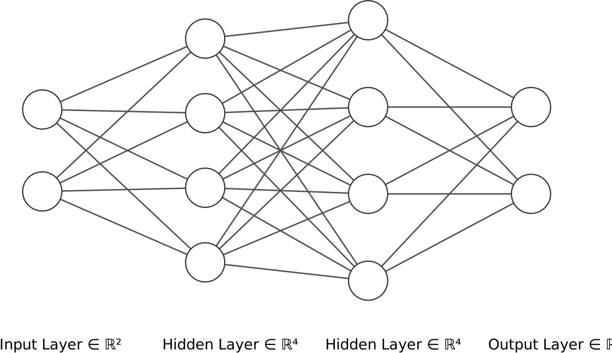
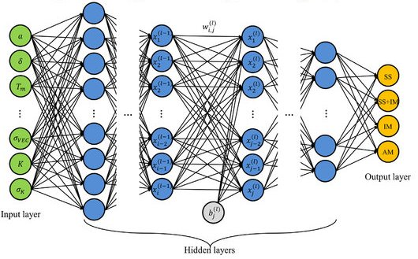
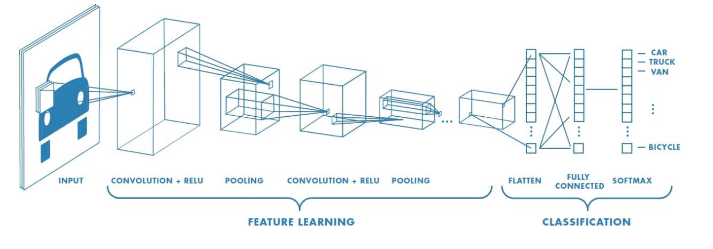
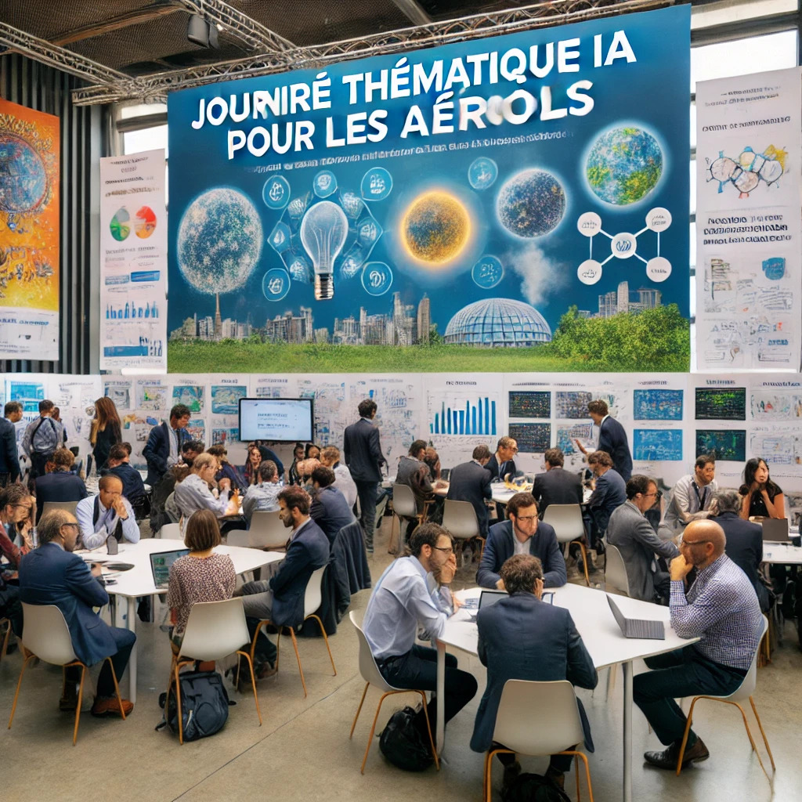
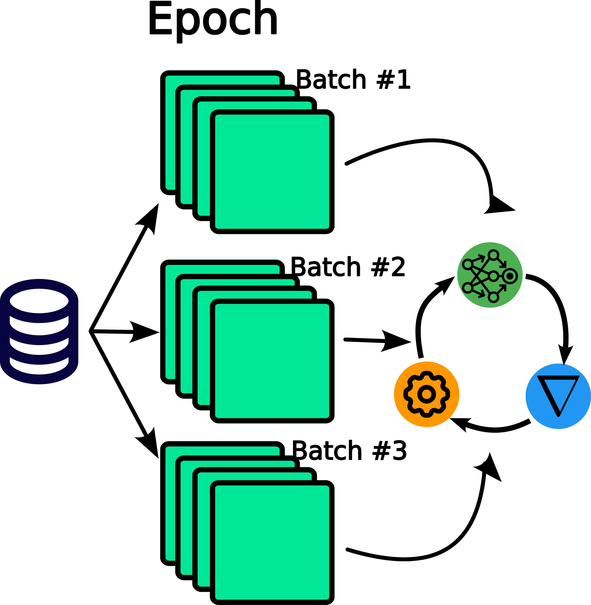
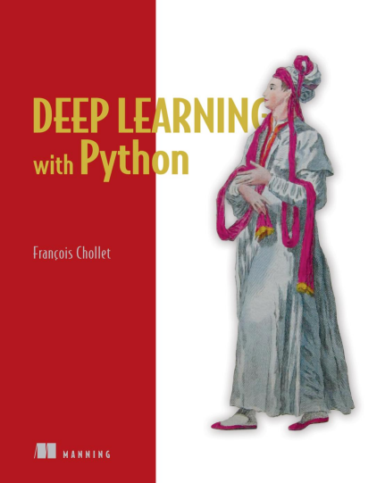

#  Neural Networks for Computer Vision

An introduction

---

# Contents

1. From simple perceptrons to complex architectures

2. Adapting neural networks to images

3. Training a model


---

# Multi Layer Perceptron


From perceptron to MLP : stack perceptron to create a network



-  [An universal approximator](https://www.sciencedirect.com/science/article/pii/0893608089900208?via%3Dihub)
- [An example](https://playground.tensorflow.org/)

---

# The Deep in Deep Learning

-  Deep : many layers
-  Wide : many neurons

The more layers, the more complex the function can be, the more data needed to train

<style>
img[alt~="center"] {
  display: block;
  margin: 0 auto;
}
</style>



---

# Convolutional Neural Networks

MLP are designed for tabular data, not for images


-  No translation invariance
-  No spatial invariance


Images have structure, and we want to exploit it

  


--- 

# CNNs


## Convolutional Layers

Centered on a pixel, apply a (learnt) filter  


## Pooling Layers

Reduce the size of the image, keep the most important information

---




--- 

# Benefits of CNNs

-  Translation invariance
-  Spatial invariance
-  Fewer parameters
-  Hierarchical features

[Let's see](https://github.com/aharley/nn_vis)

---

# Tasks in Computer Vision

Considering images, we can have different tasks :

-  Image Classification
-  Object Detection
-  Semantic Segmentation
-  ...

Everything is how to define the problem

---

# Image Classification


Given an image, predict what is in it

$$
\text{Image} \rightarrow \mathbb{N}
$$


exemple : ImageNet, CIFAR-10, MNIST

---

# Object Detection

Given an image, predict what is in it, and where

$$(\text{Image} \rightarrow \mathbb{N}) \times (\text{Image} \rightarrow \mathbb{R}^4)$$


example : YOLO, COCO, VOC

---

# Semantic Segmentation

Given an image, predict for each pixel, what is the class

$$ \text{Image} \rightarrow \mathbb{N}^{\text{width} \times \text{height}}$$


---

# Instance Segmentation

Given an image, predict for each pixel, what is the class, and to which instance it belongs

$$ \text{Image} \rightarrow \mathbb{N}^{\text{width} \times \text{height}} \times \mathbb{N}^{\text{width} \times \text{height}}$$


---
# Image Generation

Given a text, generate an image

$$ \rightarrow \text{Image}$$

example : DALL-E, midjourney, 



---

# Applications of Neural Networks in Computer Vision

-  Medical Imaging
-  Autonomous Vehicles
-  Robotics
-  ...


Different tasks, different architectures

---

# Well known architectures

A diverse set of architectures have been developed over the years

---

## AlexNet 
2012
Historical architecture, first to use CNNs for ImageNet


---

## VGG
2014
Very deep architecture, 16 or 19 layers


---

## ResNet
2015  
Residual connections, allows to train very deep networks


---

## U-Net
2015
For segmentation tasks


---

## YOLO
2016

For object detection


---

# First Conclusion

Neural Networks are a powerful tool for Computer Vision

They can be used for a wide range of tasks

Next question : how to train them?

---

# How deep learning models learn ?

---

## A deep learning model

A deep learning model is a function that maps an input to an output

$$ f : \mathcal{X} \to \mathcal{Y}$$

- - Example- - 
-  The input is an image
-  The output is a pixel class prediction
-  The model is parametrized by weights


---

## Learning Process

- Deep Learning models learn by - - minimizing a loss function- - 
- The loss function measures how well the model is performing
- Weights are updated to minimize the loss function
- $$ \mathbb{R}^{width \times height} \to \mathbb{R}$$


---

## Learning iteration

- - - Feed Forward- - : Compute the output of the network
- - - Backpropagation- - : Calculate the gradients
- - - Optimizer- - : Update the weights


---

## Feed Forward

- - - Feed Forward- -  is the process of computing the output of the network


---


## Backpropagation

- - - Backpropagation- -  is the process of calculating gradients
- According to the loss function


---

## Optimizer

$$w_{k+1} \leftarrow w_k - \alpha_k \frac{\partial L(y,\hat{y})}{\partial w_k}$$

#### Key Terms:
- $w_k$: Current weights
- $\alpha_k$: Learning rate
- $\frac{\partial L(y,\hat{y})}{\partial w_k}$ : Gradient of the cost function


### Dynamics of Learning:
- - - Step Direction- - : Show how the weights are updated iteratively.
- - - Learning Rate Impact- - : Too high → Oscillation; Too low → Slow convergence.


---


---

## Key Concepts

1. - - Epochs- - : Number of complete passes through the training dataset
2. - - Batch Size- - : Number of samples processed before updating the model
3. - - Learning Rate- - : Controls how much to change the model in response to the estimated error



---

## Summary

- Deep learning requires a - - model- -  and (lot of) - - data- - 
- Deep Learning relies on a combination of - - loss functions- - , - - optimizers- - , - - backpropagation- - , and key parameters to learn effectively.

--- 

# Deep Learning 

Steps to learn a model

1. Define the problem
4. Define the model
3. Collect the data
5. Train the model
6. Evaluate the model

... and repeat



---

# Define the problem

## What are we trying to solve ?


The problem can generally be defined by specifying the input and the output

---

# Collect the data

## What data do we have? Need of labels ?

A machine learning model needs data to learn

Finding (good) data will define the success of the model

---

# Preprocess the data

-  Images are not always in the right format
-  Some data augmentation can be useful
-  Normalization
-  Some data may be dirty (garbage in, garbage out)

---

# Define the model

## What architecture to use?

Depending on the specific task, some architectures may be more suited than others

Structure ? Reccurence ? Time Series ? Natural Language ?

---

# Code the model

-  Define the architecture using a library
-  Loss function : depending on the task
-  Optimizer : SGD, Adam, ...
-  Learning loop : classic code [see below](#learning-iteration)

Generally these steps rely on a library (PyTorch, TensorFlow, ...)

--- 

# Train the model

-  Feed the data to the model
-  Compute the loss
-  Backpropagate the gradients
-  Update the weights
-  Repeat

This step may take a long time depending on the ressources, architecture, and data

---

# Let's code

We will use PyTorch to train a simple CNN on MNIST


```python
import torch
import torchvision
import torch.nn as nn
import torch.optim as optim
import torch.nn.functional as F

train_loader = torch.utils.data.DataLoader(torchvision.datasets.MNIST('data', train=True, download=True,   transform=torchvision.transforms.ToTensor()), batch_size=32, shuffle=True)

class Net(nn.Module):
    def __init__(self):
        super(Net, self).__init__()
        self.conv1 = nn.Conv2d(1, 32, 3, 1)
        self.conv2 = nn.Conv2d(32, 64, 3, 1)
        self.dropout1 = nn.Dropout(0.25)
        self.dropout2 = nn.Dropout(0.5)
        self.fc1 = nn.Linear(9216, 128)
        self.fc2 = nn.Linear(128, 10)

    def forward(self, x):
        x = F.relu(self.conv1(x))
        x = F.relu(self.conv2(x))
        x = F.max_pool2d(x, 2)
        x = self.dropout1(x)
        x = torch.flatten(x, 1)
        x = F.relu(self.fc1(x))
        x = self.dropout2(x)
        x = self.fc2(x)
        return x

model = Net()

# Define the loss and the optimizer
criterion = nn.CrossEntropyLoss()
optimizer = optim.Adam(model.parameters(), lr=0.001)
# Train the model
nb_batch_to_print = 100
for epoch in range(10):  # loop over the dataset multiple times
    running_loss = 0.0
    for i, data in enumerate(train_loader, 0):
        inputs, labels = data
        optimizer.zero_grad()
        outputs = model(inputs)
        loss = criterion(outputs, labels)
        loss.backward()
        optimizer.step()
        running_loss += loss.item()
        if i % nb_batch_to_print == nb_batch_to_print-1:    
            print('[%d, %5d] loss: %.3f' %
                    (epoch + 1, i + 1, running_loss / nb_batch_to_print))
            running_loss = 0.0

print('Finished Training')
```

---


# Foundation Model

large AI model trained on vast amounts of data, capable of performing a wide range of tasks.
- Examples : GPT-3, BERT, DALL-E, Llama, [SAM](https://segment-anything.com/demo), ...


--- 
# Conclusion

 - Deep Learning is a powerful tool for Computer Vision
 - Many ressources are freely available
 - Learning a model is not theorically complex
 - Complexity is on the engineering side
 - Let's get a Nobel !

 


---
# References - Going further

-   [Deep Learning with Python](https://www.manning.com/books/deep-learning-with-python)
-   [Machine Learning with Pytorch and Scikit-learn](https://www.amazon.com/Python-Machine-Learning-scikit-learn-TensorFlow/dp/1789955750)
-  [Yann Le Cun au collège de france](https://www.college-de-france.fr/fr/chaire/yann-lecun-informatique-et-sciences-numeriques-chaire-annuelle/events)